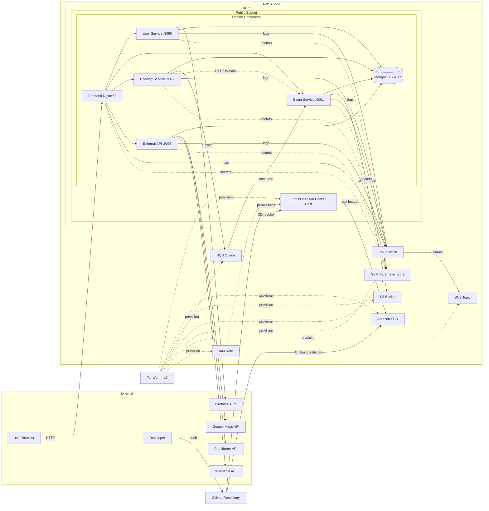

# Event Booking System Architecture

## End-to-End AWS Architecture (Deployment + Runtime)

## Description

This diagram shows the complete Event Booking System architecture including:
- CI/CD deployment pipeline
- AWS infrastructure provisioned by Terraform
- Runtime architecture with Docker containers on EC2
- Integration with external APIs
