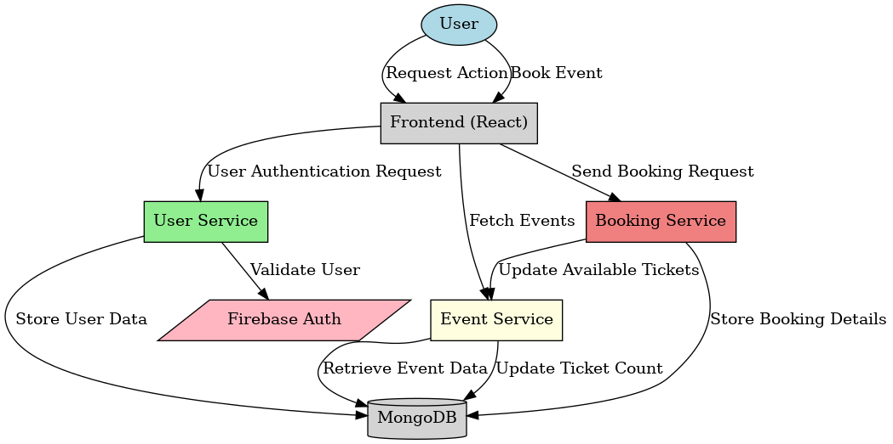

# Event Booking System - Cloud-Native Microservices on AWS

A full-stack event booking application built with microservices architecture, deployed on AWS using Infrastructure as Code (Terraform), CI/CD pipelines (GitHub Actions), and containerization (Docker).



## Tech Stack

| Layer | Technologies |
|-------|-------------|
| **Frontend** | React, React Router, Bootstrap, Axios |
| **Backend** | Spring Boot 3.4, Java 21, Maven |
| **Database** | MongoDB |
| **Authentication** | Firebase Auth |
| **Containerization** | Docker, Docker Compose |
| **IaC** | Terraform (modular) |
| **CI/CD** | GitHub Actions |
| **Cloud (AWS)** | EC2, ECR, S3, SQS, IAM, SSM, CloudWatch, SNS, VPC |
| **Security** | Trivy image scanning, SSM secrets, least-privilege IAM |
| **External APIs** | Google Maps, Frankfurter (currency), Wikipedia |

## Architecture

```
┌─────────────────────────────────────────────────────────┐
│                        AWS Cloud                         │
│  ┌─────────────────────────────────────────────────┐    │
│  │                  VPC (10.0.0.0/16)               │    │
│  │  ┌─────────────────────────────────────────┐    │    │
│  │  │          Public Subnet                   │    │    │
│  │  │  ┌─────────────────────────────────┐    │    │    │
│  │  │  │      EC2 (t3.medium)            │    │    │    │
│  │  │  │  ┌─────────┐  ┌─────────────┐  │    │    │    │
│  │  │  │  │ Frontend │  │ User Svc    │  │    │    │    │
│  │  │  │  │ (Nginx)  │  │ (Spring)    │  │    │    │    │
│  │  │  │  ├─────────┤  ├─────────────┤  │    │    │    │
│  │  │  │  │ Event   │  │ Booking Svc │  │    │    │    │
│  │  │  │  │ Service  │  │ (Spring)    │  │    │    │    │
│  │  │  │  ├─────────┤  ├─────────────┤  │    │    │    │
│  │  │  │  │External │  │  MongoDB    │  │    │    │    │
│  │  │  │  │API Svc  │  │             │  │    │    │    │
│  │  │  │  └─────────┘  └─────────────┘  │    │    │    │
│  │  │  └─────────────────────────────────┘    │    │    │
│  │  └─────────────────────────────────────────┘    │    │
│  └─────────────────────────────────────────────────┘    │
│                                                          │
│  ECR ──── S3 ──── SQS ──── SSM ──── CloudWatch ──── SNS  │
└─────────────────────────────────────────────────────────┘
         ▲                        │
         │ Push Images            │ Alerts
    GitHub Actions CI/CD     Email Notification
         ▲
         │
    Git Push (main)
```

## Microservices

| Service | Port | Description |
|---------|------|-------------|
| **User Service** | 9090 | User registration, authentication, profile management |
| **Event Service** | 9091 | Event CRUD, search by type/city/date, image management |
| **Booking Service** | 9092 | Ticket booking, cancellation, booking history |
| **External API Service** | 9093 | Currency conversion, Google Maps, city info (Wikipedia) |
| **Frontend** | 80 | React SPA served via Nginx reverse proxy |
| **MongoDB** | 27017 | Shared NoSQL database |

## AWS Services Used

| Service | Purpose |
|---------|---------|
| **VPC** | Isolated network with public subnet, internet gateway, security groups |
| **EC2** | Application host running Docker containers |
| **ECR** | Private Docker image registry (5 repositories) |
| **S3** | Event image storage (event images) |
| **SQS** | Async messaging for ticket updates between booking and event services |
| **IAM** | EC2 instance role with managed policies (ECR, S3, SQS, SSM, CloudWatch) |
| **SSM Parameter Store** | Encrypted secrets (Firebase, Google Maps API keys, admin secret) |
| **CloudWatch** | Logs, metrics, CPU/status alarms, dashboard |
| **SNS** | Email notifications for CloudWatch alarms |
| **Security Groups** | HTTP, HTTPS, SSH access control |

## CI/CD Pipeline

### CI (on every push)
1. Build 4 Java services (Maven matrix strategy)
2. Build React frontend
3. Build 5 Docker images
4. Scan images with **Trivy** for vulnerabilities
5. Push to ECR (main branch only)

### CD (after CI on main, when AWS secrets are set)
1. Copy production compose file to EC2
2. SSH into EC2, pull latest images from ECR
3. Deploy with `docker-compose -f docker-compose.prod.yml up -d`
4. Health check all services via `/actuator/health`

## Project Structure

```
event-booking/
├── .github/workflows/       # CI/CD pipelines
│   ├── ci.yml               # Build, scan, push
│   └── cd.yml               # Deploy to EC2
├── terraform/               # Infrastructure as Code
│   ├── main.tf              # Root module
│   ├── variables.tf         # Input variables
│   ├── outputs.tf           # Output values
│   ├── provider.tf          # AWS provider
│   ├── backend.tf           # S3 remote state
│   └── modules/
│       ├── vpc/             # VPC, subnets, security groups
│       ├── ec2/             # EC2 instance + user-data
│       ├── ecr/             # Container registries
│       ├── iam/             # Roles and policies
│       ├── s3/              # Image storage bucket
│       ├── sqs/             # Ticket updates queue
│       ├── ssm/             # Secrets in Parameter Store
│       └── monitoring/      # CloudWatch, SNS, alarms
├── user/                    # User microservice (Spring Boot)
├── event/                   # Event microservice (Spring Boot)
├── booking/                 # Booking microservice (Spring Boot)
├── external-api/            # External API microservice (Spring Boot)
├── eventbooking-app/        # React frontend
├── docs/                    # LinkedIn post template, Mermaid diagram
├── docker-compose.yml       # Local development
├── docker-compose.prod.yml  # Production (ECR images, CloudWatch logs)
└── deploy-to-ec2.sh         # Manual deploy script (SCP + SSH to EC2)
```

## Getting Started

### Prerequisites
- Java 21 (JDK)
- Node.js 18+
- Docker and Docker Compose
- AWS CLI (for production deployment)
- Terraform 1.0+ (for infrastructure)

### Local Development

```bash
# Build all Java services
export JAVA_HOME=/usr/lib/jvm/java-21-openjdk-amd64
for svc in user event booking external-api; do
  (cd $svc && ./mvnw clean package -DskipTests -q)
done

# Start everything with Docker Compose
docker compose up --build -d

# App available at http://localhost:3000
```

### Production Deployment (AWS)

**Option A: Terraform + CI/CD (when GitHub secrets are configured)**

```bash
cd terraform
cp terraform.tfvars.example terraform.tfvars
# Edit terraform.tfvars: ec2_key_name, alert_email, Firebase/Google API keys (or use TF_VAR_*)

terraform init
terraform plan
terraform apply   # Creates VPC, EC2, ECR, S3, SQS, IAM, SSM, CloudWatch, SNS

# Add GitHub repo secrets: AWS_ACCESS_KEY_ID, AWS_SECRET_ACCESS_KEY, AWS_ACCOUNT_ID,
# EC2_HOST, EC2_SSH_KEY, and REACT_APP_FIREBASE_* for frontend build.
# Push to main → CI builds images, pushes to ECR; CD deploys to EC2.
```

**Option B: Manual deploy (build locally, then run script)**

```bash
# 1. Create EC2 key pair and deploy infra (see Option A), then build and push images to ECR.
# 2. Update EC2_IP in deploy-to-ec2.sh if needed (or use terraform output ec2_public_ip).
./deploy-to-ec2.sh   # Copies compose + serviceAccountKey, runs docker-compose on EC2
# App at http://<EC2_PUBLIC_IP>
```

Default Terraform region is `us-east-1`; override in `variables.tf` or `terraform.tfvars` if needed.

### Tear Down

```bash
cd terraform
terraform destroy
```

## Environment Variables

See [.env.example](.env.example) for all required configuration.

## Security

- Firebase service account keys excluded from Git via `.gitignore`
- API keys stored in AWS SSM Parameter Store (encrypted)
- Docker images scanned with Trivy in CI pipeline
- IAM role follows least-privilege principle
- SSH access restricted by CIDR in security groups
- ECR repositories have lifecycle policies (keep last 5 images)

## Monitoring

- **CloudWatch Logs**: All container logs streamed via `awslogs` driver
- **CloudWatch Metrics**: CPU, memory, disk, network
- **CloudWatch Alarms**: CPU > 80%, status check failures
- **SNS Alerts**: Email notifications on alarm state changes
- **CloudWatch Dashboard**: Single view of all metrics and logs
- **Health Endpoints**: `/actuator/health` on each service
