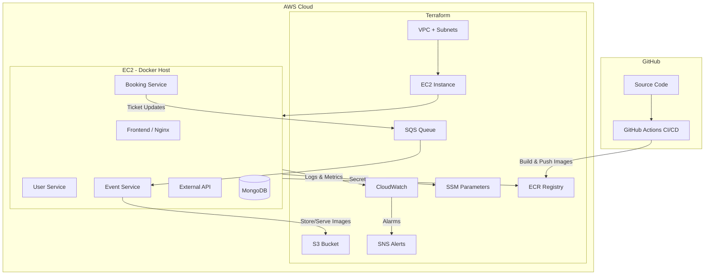

# LinkedIn Post – Event Booking on AWS

Use this for your post. Copy the Mermaid diagram into a tool like [Mermaid Live](https://mermaid.live) to export as PNG, or use the code in a blog/README.

---

## Suggested post text

**Built and deployed a full-stack Event Booking app on AWS**

End-to-end project covering:

• **Infrastructure as Code** – Terraform modules for VPC, EC2, ECR, S3, SQS, IAM, SSM, CloudWatch, SNS  
• **CI/CD** – GitHub Actions: build → test → Trivy scan → push to ECR → deploy to EC2  
• **Microservices** – React frontend + 4 Spring Boot services + MongoDB, containerized with Docker  
• **AWS** – EC2 as app host, ECR for images, S3 for event images, SQS for async ticket updates, SSM for secrets, CloudWatch for logs/metrics/alarms, SNS for email alerts  

Architecture diagram below. Repo and details in the comments.

#AWS #DevOps #Terraform #CICD #Docker #CloudComputing #Microservices

---

## Architecture diagram (Mermaid)

Use this in [Mermaid Live Editor](https://mermaid.live): paste the code → export as PNG/SVG for LinkedIn.

---

## Short “services used” list (for caption or comments)

- **Compute:** EC2  
- **Containers:** Docker, ECR  
- **Storage:** S3 (event images)  
- **Database:** MongoDB (on EC2)  
- **Messaging:** SQS (async ticket updates)  
- **Secrets:** SSM Parameter Store  
- **Monitoring:** CloudWatch (logs, metrics, dashboard, alarms)  
- **Alerts:** SNS (email)  
- **Networking:** VPC, Security Groups  
- **Security:** IAM (least-privilege role for EC2)  
- **IaC:** Terraform  
- **CI/CD:** GitHub Actions  

---

## One-line summary for your profile or headline

*Built a cloud-native event booking platform on AWS with Terraform, Docker, and GitHub Actions CI/CD.*
